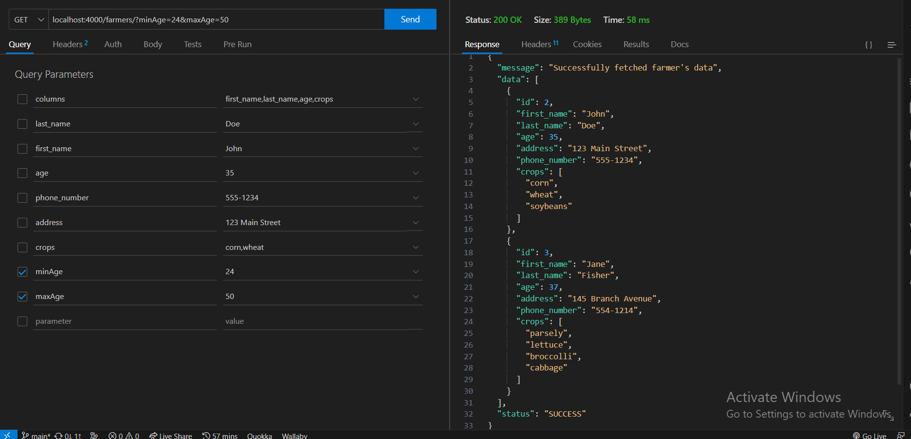

# Crop2cash API Specifications
The Crop2Cash API provides endpoints to manage farmer data and crop information.

# Base URL
The base URL for the Crop2Cash API is `http://localhost:4000`

# Endpoints
- ## Create a Farmer Record
  Method: **POST**  
  Endpoint: /farmers  
  Request Body:  
  ```json
  {
    "first_name": "John",
    "last_name": "Doe",
    "age": 35,
    "address": "123 Main Street",
    "phone_number": "555-1234",
    "crops": ["corn", "wheat", "soybeans"]
  }
  ```
  Response:
  ```json
  {
    "message": "Successfully added farmer",
    "data": {
      "id": 1,
      "first_name": "John",
      "last_name": "Doe",
      "age": 35,
      "address": "123 Main Street",
      "phone_number": "555-1234",
      "crops": ["corn", "wheat", "soybeans"]
  },
  "status": "SUCCESS"
  }
  ```

- ## Get Farmers
  Method: **GET**  
  Endpoint: /farmers  
  **Query Parameters:**  
  - columns: Comma-separated list of attributes to retrieve. Default is all attributes.  
  - first_name: Filter by exact match of first name.  
  - last_name: Filter by exact match of last name.  
  - age: Filter by exact match of age.  
  - address: Filter by exact match of address.  
  - phone_number: Filter by exact match of phone number.  
  - crops: Filter by exact match of crops. Can specify multiple crops separated by commas. 
  - minAge: Filter by minimum age `# if minAge is to be used, maxAge must be specified`
  - maxAge: Filter by maximum age `# if maxAge is to be used, minAge must be specified`  
  ## example request query parameters
    
  Response:
  ```json
  {
  "message": "Successfully retrieved farmers by crop",
  "data": [
    {
      "first_name": "John",
      "last_name": "Doe",
      "crops": ["corn", "wheat"]
    },
    {
      "first_name": "Jane",
      "last_name": "Smith",
      "crops": ["maize", "soybeans"]
    },
    ...
  ],
  "status": "SUCCESS"
  }
  ```